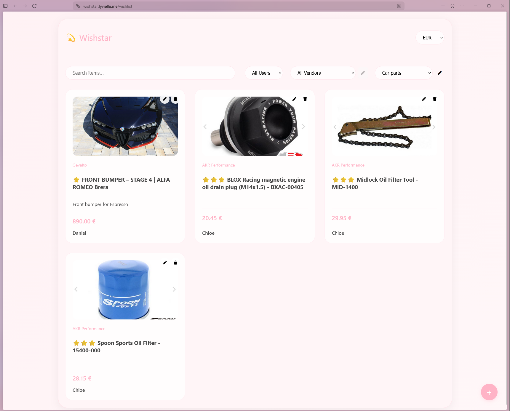
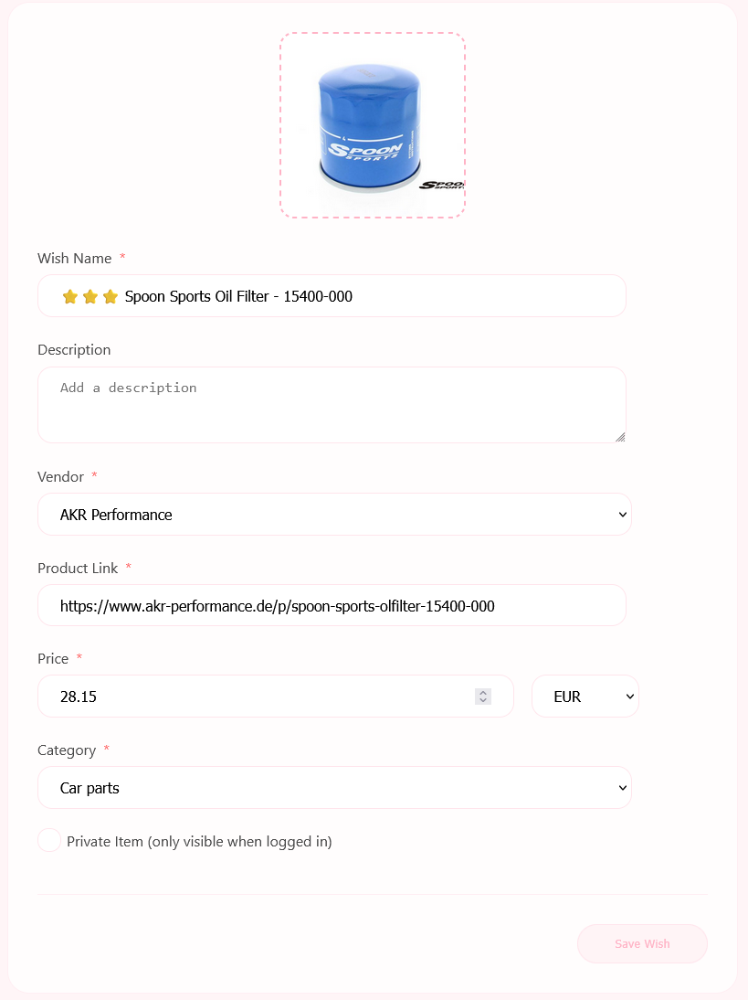
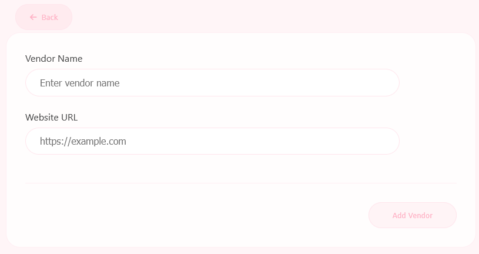
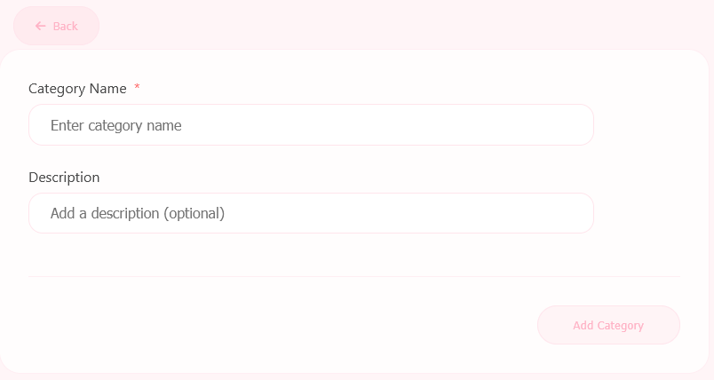

# Wishstar ⭐

A private ASP.NET-powered wishlist application for tracking desired items with detailed information and flexible organization.

## Overview

Wishstar is a lightweight, personal wishlist management system designed for small-scale private use. Built with ASP.NET, it provides a simple yet comprehensive interface for cataloging items you'd like to purchase, complete with vendor tracking, categorization, and privacy controls.

## Features

### Creating a Wish

Each wish entry includes:

- **Picture** - Visual representation of the desired item (required)
- **Name** - Title of the wish (required)
- **Description** - Additional details about the item (optional)
- **Vendor** - Select from existing vendors or add a new one via dropdown (required)
- **Product Link** - Direct URL to the item (required)
- **Price** - Item cost with multi-currency support: EUR, RSD, YEN, USD, GBP (required)
- **Category** - Organize wishes by selecting or creating categories (required)
- **Private Item** - Checkbox to restrict visibility to logged-in users only

### Managing Vendors & Categories

Vendors and categories can be created on-the-fly through dedicated interfaces, allowing for flexible organization as your wishlist grows.

### Browsing & Filtering

- View all wishes in a clean list format
- Filter by search text (searches both title and description)
- Filter by user who created the wish
- Filter by specific vendors or categories
- Click any wish to open its product link in a new tab
- Switch viewing currency in the upper right corner

### Privacy & Access Control

- Secure login with email and password
- User accounts created server-side only (no public registration)
- Edit or delete wishes when logged in (indicated by icons near each item)
- Control wish visibility with the "Private Item" toggle

## Technical Details

- Built with ASP.NET
- Configuration stored in encrypted JSON files
- Designed for 2-user private deployment
- No database required

---

*A simple, personal project for managing shared wishlists between partners.*
